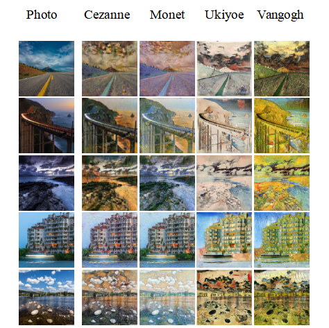

# 迁移结果


# 环境
python3.8
tensorflow2.6.0
keras2.6.0

# 目录结构
- datasets 数据集
  - photo
  - cezanne
  - monet
  - ukiyoe
  - vangogh

# 训练
```shell
python train.py
```

# 测试
```shell
python test.py
```
